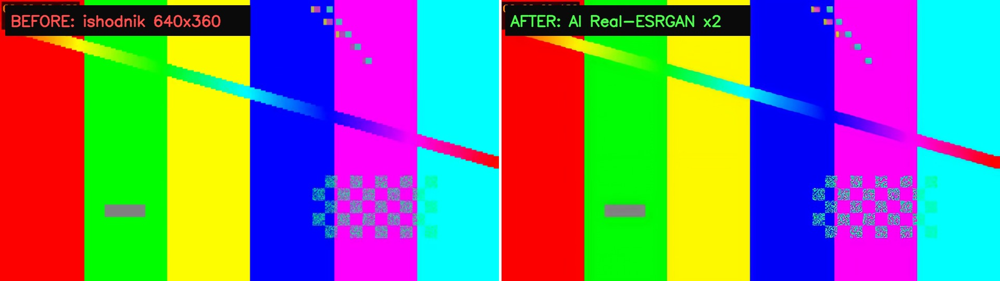
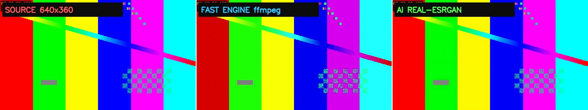

# 🎬 ВИДЕО-АПСКЕЙЛЕР — улучшение качества видео до 4K

Консольная программа на Python, которая повышает разрешение и
улучшает качество видео: убирает шум и «мыло», добавляет резкость и детали,
поднимает SD/DVD/720p до Full HD, 2K, **4K** и даже 8K.

Никаких подписок, водяных знаков и ограничений. Всё работает локально на
твоём компьютере, видео никуда не загружается.



*Слева — исходный кадр 640×360, справа — тот же момент после AI-апскейла
Real-ESRGAN. Программа сама сохраняет такой кадр «ДО | ПОСЛЕ» рядом с
каждым готовым видео.*

---

## ⚡ Быстрый старт (Windows)

1. Установи **Python 3.9+**: https://www.python.org/downloads/windows/
   При установке обязательно поставь галочку **«Add python.exe to PATH»** —
   без неё консоль не увидит команду `python`.
2. Скопируй папку `VideoUpscaler` куда удобно (например, `D:\VideoUpscaler`).
3. Один раз поставь компоненты — раздел **«📥 Установка компонентов»** ниже.
   Это две минуты и ~125 МБ скачиваний: FFmpeg и, по желанию, AI-движок.
   Интернет нужен только для этой установки, дальше всё работает офлайн.
4. Дважды кликни **`Start.bat`** (или выполни `python upscaler.py` в этой
   папке) — откроется меню программы.
5. Перетащи видеофайл прямо в чёрное окно и нажми Enter. Дальше программа
   спросит: какой движок, до какого разрешения, какой пресет.

Готовые видео программа складывает в папку **`result`** внутри своей папки
(рядом с `upscaler.py`). Исходники никогда не изменяются и не перемещаются.

---

## 📥 Установка компонентов (один раз)

Сама программа — это `upscaler.py`. Ей нужны два внешних движка:
**FFmpeg** (обязательный: им работает быстрый апскейл и сборка видео)
и **Real-ESRGAN** (нейросеть для AI-режима). Ставятся любым из двух способов.

### Способ 1 — из самой программы (проще всего)

Запусти `Start.bat` и выбери в меню:

* **пункт 3** — установить/обновить **FFmpeg** (скачается официальная сборка);
* **пункт 4** — установить **AI-движок Real-ESRGAN** с моделями.

То же самое из командной строки:

```
python upscaler.py --install-ffmpeg
python upscaler.py --install-ai
```

Если при запуске FFmpeg не найден, программа сама предложит скачать его —
можно согласиться прямо там.

### Способ 2 — вручную

**FFmpeg:**

1. Скачай архив с https://www.gyan.dev/ffmpeg/builds/ (сборка
   `release essentials`).
2. Распакуй и скопируй из его папки `bin` файлы **`ffmpeg.exe`** и
   **`ffprobe.exe`** в `VideoUpscaler\tools\` (папку создай сам).
   Кладить можно и в любое другое место: программа обыскивает свою папку
   со всеми подпапками, системный PATH и типичные места установки
   (Winget, Scoop, Chocolatey и др.) — найдёт сама.

**Real-ESRGAN (AI-движок):**

1. Проще всего — пункт меню **4** (или `python upscaler.py --install-ai`):
   программа сама скачает движок и модели с официального релиза
   Real-ESRGAN (~45 МБ) и разложит в `apps\realesrgan\`.
2. Для установки без интернета: скачай архив вручную с
   https://github.com/xinntao/Real-ESRGAN/releases (версия v0.2.5.0,
   сборка `windows`) и распакуй всё содержимое в
   `VideoUpscaler\apps\realesrgan\`, чтобы рядом лежали
   `realesrgan-ncnn-vulkan.exe` и папка `models\`.
   Или просто положи скачанный архив в папку `assets\` (создай её, если
   её нет) — пункт меню **4** распакует его сам.

Проверить, что всё встало, можно в меню **пункт 5** (проверка видеокарты и
AI), а статус найденных компонентов виден сразу при запуске программы.

### Что нужно на компьютере

* **Windows 10/11** (64-bit).
* **Python 3.9+** с галочкой «Add python.exe to PATH» (см. шаг 1).
* Видеокарта — желательна для AI-движка (подойдёт любая с Vulkan: NVIDIA,
  AMD, Intel Iris). Без неё AI тоже работает, но очень медленно.
* Свободное место: результат в 4K занимает в 5–20 раз больше исходника.

---

## 🧠 Два движка

| | **БЫСТРЫЙ (ffmpeg)** | **AI (Real-ESRGAN)** |
|---|---|---|
| Что делает | умный апскейл + шумодав + резкость + цвет + зерно | нейросеть **дорисовывает** детали (текстуры, волосы, кирпичи, листву) |
| Скорость | быстро: минуты на фильм даже на слабом ПК | с видеокартой — минуты; без неё — часы |
| Когда брать | повседневные видео, длинные фильмы, слабое железо | аниме, старые записи, клипы, всё где важна детализация |
| Требует | ничего сверх ffmpeg | видеокарту с Vulkan (желательно) |

Программа сама проверит видеокарту (пункт меню **5**) и подскажет, потянет ли
она AI. Перед большой AI-обработкой предлагается прогнать **5-секундный тест**,
чтобы глазами оценить результат и скорость.

### Модели нейросети
* `general` — **realesrgan-x4plus**: фильмы, сериалы, съёмка с камеры.
* `anime` — **realesrgan-x4plus-anime**: мультфильмы и аниме, чистые линии.
* `fast` — **realesr-animevideov3**: в 3–5 раз быстрее, хороша для аниме
  и когда видеокарта слабенькая.

### Пресеты быстрого движка
* `soft` — мягко, без «перешарпа»: только аккуратный апскейл и цвет.
* `balanced` — рекомендуемый: шумодав + резкость + лёгкое кино-зерно.
* `max` — максимум резкости и чистоты.
* `restore` — реставрация: деинтерлейсинг, подавление блоков MPEG, сильный
  шумодав. Для VHS, DVD, старых камер и ТВ-записей.

---

## 📸 Примеры обработки



Один и тот же кадр тремя способами: исходник → быстрый движок → нейросеть.
На тестовой картинке разница скромная, но на реальном видео (фото-съёмка,
аниме, старые записи) она гораздо заметнее: AI дорисовывает фактуры, края
и мелкие детали, а быстрый движок даёт чистую резкую картинку без «мыла».

---

## 🖥 Интерактивное меню

```
Start.bat
  1 — улучшить видео (файл или папку; можно просто перетащить путь в окно)
  2 — пакетная обработка всех видео в папке
  3 — установить/обновить FFmpeg
  4 — установить AI-движок Real-ESRGAN
  5 — проверить видеокарту (Vulkan) и готовность AI
  6 — открыть папку программы
  0 — выход
```

После каждого успешного прогона рядом с результатом появляется кадр
**`..._сравнение.jpg`** — «ДО | ПОСЛЕ» бок о бок, удобно проверять качество.

---

## ⌨ Командная строка (без меню)

```bat
python upscaler.py                                    :: интерактивное меню
python upscaler.py "D:\video\film.mp4" --target 4k    :: быстрый движок в 4K
python upscaler.py film.mp4 -e ai -t 1080 -m anime    :: нейросетью в Full HD
python upscaler.py film.mp4 -t x2 -p max              :: вдвое, пресет max
python upscaler.py film.mp4 -e ai --preview 5         :: тест 5 секунд через AI
python upscaler.py "D:\Папка" --batch -e fast -t 4k   :: вся папка в 4K
python upscaler.py --check-gpu                        :: есть ли Vulkan?
python upscaler.py --install-ffmpeg                   :: поставить ffmpeg
python upscaler.py --install-ai                       :: поставить нейросеть
```

| Флаг | Значение |
|---|---|
| `-e / --engine` | `fast` или `ai` |
| `-t / --target` | `720` `1080` `1440` `4k` `8k` `x2` `x3` `2560x1440` |
| `-p / --preset` | `soft` `balanced` `max` `restore` |
| `-m / --model` | `general` `anime` `fast` |
| `--fps 60` | интерполяция движения до 60 fps (медленно!) |
| `--preview N` | обработать только первые N секунд (примерка) |
| `--out file.mp4` | имя результата |
| `--yes` | без подтверждений (для скриптов) |
| `--batch` | обработать всю папку |
| `--no-preview` | не делать кадр «ДО/ПОСЛЕ» |

Результат кладётся в папку **`result/`** внутри папки программы:
`result/имя_3840x2160_HD.mp4` или `result/имя_3840x2160_AI.mp4`,
туда же — кадры `result/имя_..._сравнение.jpg`. Исходник не трогается.
Флаг `--out` позволяет указать своё место для файла.

---

## 📦 Структура папки

```
VideoUpscaler/
├── upscaler.py            ← сама программа
├── Start.bat             ← меню двойным кликом (или: python upscaler.py)
├── README.md              ← этот файл
├── docs/                  ← фото для README («до/после», сравнение движков)
├── result/                ← ГОТОВЫЕ видео и кадры «ДО/ПОСЛЕ» (создаётся сама)
├── assets/                ← сюда можно положить архив AI для офлайн-установки
├── tools/                 ← сюда кладётся ffmpeg.exe (см. установку выше)
└── apps/realesrgan/       ← сюда распаковывается нейросеть (см. установку)
```

Папка `temp` появляется только на время AI-обработки и **полностью удаляется**
после неё. При каждом запуске программа также вычищает остатки от прошлых
аварийно прерванных обработок — мусор не копится.

---

## 🔧 Если что-то не так

* **«FFmpeg не найден»** — программа ищет его сама и везде: в папке `tools`,
  в своей папке и подпапках (куда бы ты ни распаковал сборку), в системном
  PATH и в типичных местах установки (Winget, Scoop, Chocolatey,
  `C:\ffmpeg`). Если всё равно не нашла — пункт меню **3**
  (`python upscaler.py --install-ffmpeg`) или положи `ffmpeg.exe` и
  `ffprobe.exe` в папку `tools` вручную, как описано в разделе
  «📥 Установка компонентов».
* **AI пишет «Vulkan недоступен»** — значит, нейросеть будет считать на
  процессоре (очень медленно). Либо обнови драйвер видеокарты, либо бери
  быстрый движок. Проверка: пункт меню 5.
* **Квадратики вместо русского текста в cmd** — программа сама переключает
  консоль в UTF-8; если не помогло, запусти `chcp 65001` и повтори.
* **Мало места на диске** — программа обрабатывает видео порциями и сама
  следит за свободным местом; но итоговый 4K-файл всё равно большой.
  Уменьши целевое разрешение или удали старые результаты.
* **Очень медленно в 4K на слабом ПК** — возьми 1080p/1440p или пресет `soft`;
  для AI попробуй модель `fast`.
* Антивирус ругается на `realesrgan-ncnn-vulkan.exe` — это ложняк, добавь
  папку `apps` в исключения.

---

## ❓ Честно о магии

Апскейл не превращает мыльное SD в идеальную 4K-съёмку: нейросеть
*правдоподобно дорисовывает* детали, а не восстанавливает утраченное.
Но разница «до/после» на глазах огромная — особенно для аниме, мультфильмов,
старых домашних записей и всего, что снято в 480p/720p.

Лицензии компонентов: FFmpeg (LGPL/GPL), Real-ESRGAN (BSD-3),
модели — свободные для личного использования.
